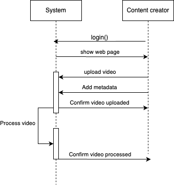
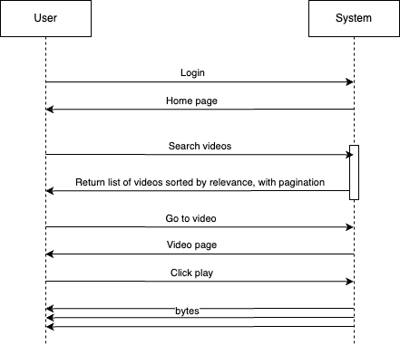
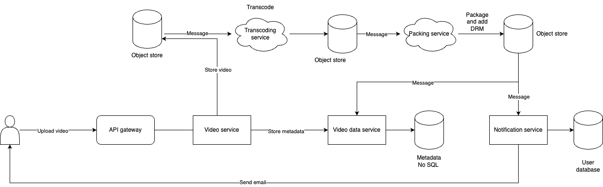
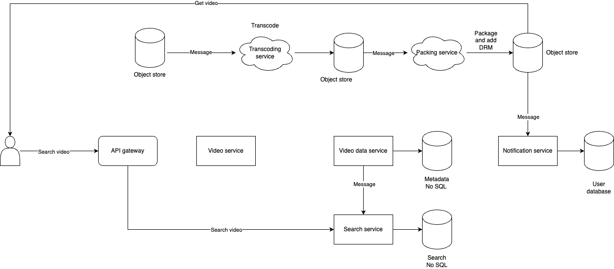

# Design a video on-demand system

## Functional requirements

### Questions about content creator
- Can content creator edit video after upload?
- What information provided by the cc?
- Is this for video uploading online or streaming as well
- What formats do we support?

### Questions about views
- What attribute can users use to search videos?
- Can any users watch any videos or registered only?
- What devices do we support?
- Can users do anything else other than watching videos?

### Scope
- A content creator should be able to upload videos with any format
- Each video should have metadata: title, description, tags... can be updated
- When a video is available, an email is sent to users
- Users need to register and subscribe 
- Free text search 

### Out of scope
- Streaming
- Payment

## Non-functional requirements for content creator
### Scalability
- A few thousands cc uploading 1 video/week.
- Each video can be 1 hour long, high resolution, uncompressed
- Each video 50GB (>50TB/week)

### Availability
- For content creator: 99% uptime

### Performance
- Response time <500ms at 99pt
- Waiting time a few hours

### Data consistency (CAP)
- CP over AP, cc always see the latest information about their videos or not at all

## Non-functional requirements for user
### Scalability
- Hundreds of millions of users
### Availability
- 99.99% uptime
### Performance
- Search result <500ms at 99pt
- Zero buffering time
### Data consistency (CAP)
- AP over CP, users can still see old videos, better than no videos at all

## System API design
- Sequence diagram for content creators uploading videos
	
- Sequence diagram for users to search and watch videos
	

## System design
- Each media file type is a container that contains a video stream, audio stream, subtitle and metadata, to support multiple formats, we have to support multiple containers
- The algorithms to encode videos are called codec, most videos shot by camera are encoded by a lossless codec but this makes the file very huge
- The first step to read a file format is to compress it into a lossly codec.
- File size = bit rate * video length, we need to reduce the bit rate to reduce the size while still provide high enough resolution to users
- We can generate multiple videos with different resolutions ,framerates for different devices from low to high end.
- The banwidth could be changed in the middle of stream, we can use a technique called Adaptive Bit Rate / Adaptive Streaming to divide the video streams into small segments, 5-10 sec long, and store the references of those streams into a manifest file (m3u8/mpd).
- When a user starts streaming, the device downloads the manifest file and buffering the first 3 segments, it then analyze the time taken to download and decide whether to switch to a higher or lower resolution stream
- Different devices have different protocol to stream, ex: Apple HLS, MPEG DASH...
- We also need to use a DRM to prevent the stream from being hijacked and played on another platform. Only registered users can watch the encrypted stream on our platform.
### System design for content creators to upload videos
- When `video service` send the original video to the `object store`, the store then sends a message through a message broker to trigger the `transcoding service`.
- The `transcoding service` save the transcoded videos with different bit rates to its own `object store` and send a message to `packaging service`
- The `packaging service` package the videos with DRM and stores them to the final `object store`
- Upon completion, the `packaging service` sends a message to `notification service` to notify user and to `video data service` to update their metadata
	
### System design for users to search and watch videos
- The `video data service` sends a message to `search service` when a video is uploaded so that it can update its `search No SQL database`
- When a user searches for a title, the API gateway calls the `search service` to get a list of videos.
- The user's device then uses the URL to get the stream from the `object store`
	
	

