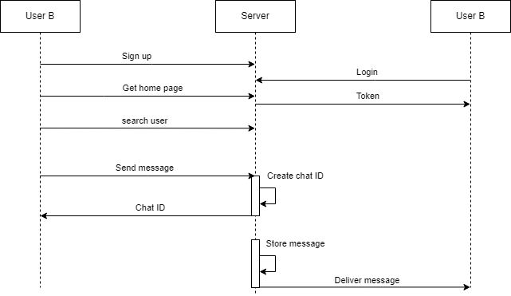
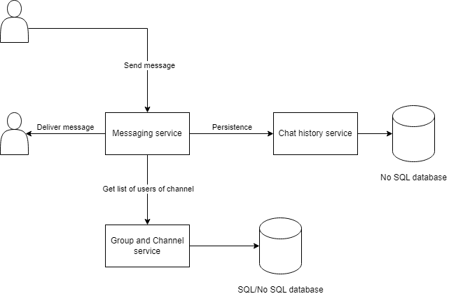
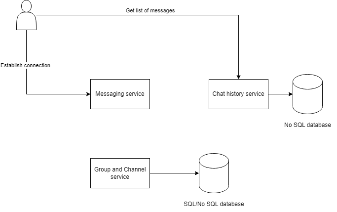
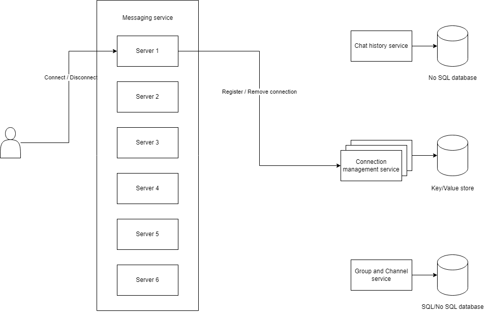
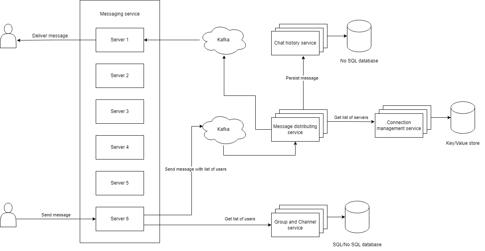

# Instant messaging

## Functional requirements
- 1-1, group and channel chat
- Type of media:
  - Text only
- Online users get notified, offline users get messages when they're back online
- Visible online/offline status

## Non-functional requirements
- Millions of daily users
- Most users are connected for 6-12 hours/day
- Hundreds of thousands of messages/second
- Each message is limited to 10k characters
- Channels/group chats can grow to hundreds of thousands of users
- 99.99% uptime
- Message delivery time <1000ms at 99pt
- Catching up on messages after connection <2000ms at 99pt

## System API design
- signup()
- login()
- get_homepage()
- user_search()
- send_message()
- create_channel()
- join_channel()
- send_message()

## System design
- Use WebSocket connections
- Idle WebSocket connections require very little RAM and CPU

### Send message flow
  
- When a user sends a message to `messaging service`, it sends request to `chat history service` for persistence and to `channel & group service` to get a list of subscribers of the channel or group
- Then the messaging service delivers the message to all connected users

### Get message history flow
  
- When a user comes back online, it establishes a connection to the `messaging service`
- At the same time, it also sends request to `message history service` to get lists of messages

### Scalability
  
- The `connection management` service is a high performance service connecting to a high performance `key/value store` to store pairs of user IDs and the `messaging services` each user connects to.
- When a user connect to the `messaging service`, it registers with the `connection management service`
- When a user disconnect from the `messaging service`, it updates the `connection management service` to remove the connection
  
  
- When a user sends a message to `messaging service`, the it gets a list of users of the channel from `channel & group service`
- Then the `messaging service` sends the payload of message and a list intended users to Kafka to distribute to `message distributing service`
- The `message distributing service` first sends a request to save the message to `message history service` to persist the message
- Then the message distributing service sends a request to `connection management service` to get a list of servers connected to users
- Then it sends the payload including the message, list of users to Kafka's topics respected to each server to distribute to intended servers
- Finally we should have an `API gateway` with limited rating to stop users from sending an unreasonable amount of messages at the same time.

### Availability
- We can achieve availability by replicating services and sharding database

### Performance
- To improve login performance, in user database, we can have an index with hashed username as key
- To improve getting chat history performance, in chat history database, we can have 2 compound indexes:
  - One with hash(`group_id`) and sorted(`message_id`)
  - One with hash(`channel_id`) and sorted(`message_id`)
- When user logins, they can query both these indexes to get the latest messages of groups and channels
- In channel&group database, we can add indexes to group_participants and channel_participants table with hashed `group_id` and `channel_id` so that the `messaging service` can fetch the list of users faster when sending messages
- We can also have another index with hashed `user_id` to get list of channels and groups whenever a user logins