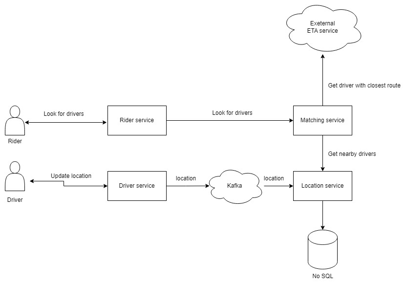

## Functional requirements

- Registering a new user, logging in an existing user
- Each driver can match with multiple rider
- Price of a ride includes: base flat fee, duration, distance
- Need to minimize:
  - The waiting time 
  - Distance/time for the driver to pick up riders
- Collect payment information from users
- Bank information to pay riders
- Out of scope:
  - Registering drivers
  - ETA calculation service
  - Payment service

## Non-functional requirements
- Millions of daily users
- Hundreds of thousands of drivers
- Drivers' location every ~5-10 seconds = 1.7 billion messages/day
- 99.99% uptime
- User login < 100ms at 99pt
- Match users with drivers within 5sec at 50pt and 10sec at 99pt

## API design

- In order for the driver to update their location constantly in real time, there has to be a bi-directional like websocket

- For driver to receive notification of a new rider and for rider to update the driver's location, they also need websocket connections

- Driver's APIs:
  - login
  - driver_join
  - send_location
  - start_ride
  - finish
- Rider's API:
  - register
  - login
  - request_ride

## System design

- We need to have a `Driver service` and a `Rider service` that keep websocket connections to drivers and users
- The location of the driver is constantly updated to the `Driver service` which passes this to a `Kafka` and then to `Location service` which only keeps the latest location of the driver in its high performance No SQL database

- When a user searches for drivers, the Rider service passes the location of the user to `Matching service`.
- The `Matching service` draws a circle with a 1km diameter and queries the `Location service` to fetch the nearby drivers
- Thanks to the requirement that not requires `ETA service`, we can send a batch request to an external `ETA service` to get the driver with the shortest rout to the user

- The logic to choose the driver could be simple by getting the closest driver
- It could also be complex when considering whether the driver is finishing their current drive, sharing ride or drivers who have not got a ride for a while
- `Matching service` then sends request to:
  - `Trip service` to create a new trip
  - `Location service` to update driver's status as `BOOKED`
  - `Rider service` to inform about driver's information
  - `Driver service` to inform about user's information

- When the driver has picked up the user, a start ride request is sent to `Location service` to update driver's status as `IN_TRIP`
- Another request from `Driver service` is sent to `Trip manager service` to update the trip's info
- During the trip, driver's location is still updated in real time to `Location service` and then to `Rider service`

- When the driver arrives at the destination, they can send finish request to Driver service and then to `Location service`.
- The `Location service` can compare the current location with the destination from `Trip manager service` to check whether the trip is finished
- The user can also ask to drop off by sending a finish request to the Rider service and then to `Location service`
- Upon finishing the trip, `Location service` updates the status of the driver as `FREE`
- The `Location service` then sends a request to `Trip manager service` to mark the trip as `FINISHED`

- The `Trip manager service` uses the information about the trip to calculate the fare and sends payment request asynchronously to the `Payment service` to charge the user and pay the driver
- A `Trip map generator` will read all events from the `streaming service` to generate a map of the trip
- It then sends this image to the `Notification service` to send an email to the user
- When the `Payment service` has completed the transaction to driver's account, it sends another request to `Trip map generator` to get the cached image, then sends notification to the driver

### Scalability

- To ensure the scalability of the system, we should have multiple instances for each service running behind a load balancer 

- To keep the records of which server connecting to which user/driver, we have a `Connection manager service` which keeps records of the connections in its high performance No SQL database
- When the `Matching service` and `Location service` need to send a request to users or drivers, it first sends the request to the `Connection manager service`, the service queries its database and forwards the request to the respecting server

### Availability
- To improve the availability, we can replicate the databases

### Performance
- To ensure the login time < 100ms for 99pt, we can create an index with index key is username to query passwords
- We can use a `bloom filter`, scanning through the table and hash the username, the bloom filter then mark the slot associated to that key as 1, how ever the bloom filter doesn't store the key or its value
- When querying a key, the bloom filter then returns 2 possibilities, either the key doesn't exist at all or it may exist.
- To avoid collisions, we can run a key through 3 hash functions and save all of them in the filter, if a username doesn't match 1 of the slots then it definitely doesn't exist
- If a username exists then we can do the more expensive password querying operation
- This approach can save us a lot of request for usernames that don't exist

- To calculate the nearby drivers, we can divide the geography into smaller grids 
- When a driver updates their location, the `Location service` calculates the latest grid along with longtitude and latitude
- The `Location service` also updates the hash table `drivers_grid` which has grid_id as key and values are the driver IDs.
- When a user looks for nearby driver, we can find all grids within 1km either by pre-storing the nearby grids for each grid.
- Then we can query the `Location service`'s database to fetch drivers from each grid
- To improve performance, we can shard the database based on the grid ID so we can query multiple shards at the same time.
- We can use `Geohash` algorithm which is free and supported by many librabries and databases