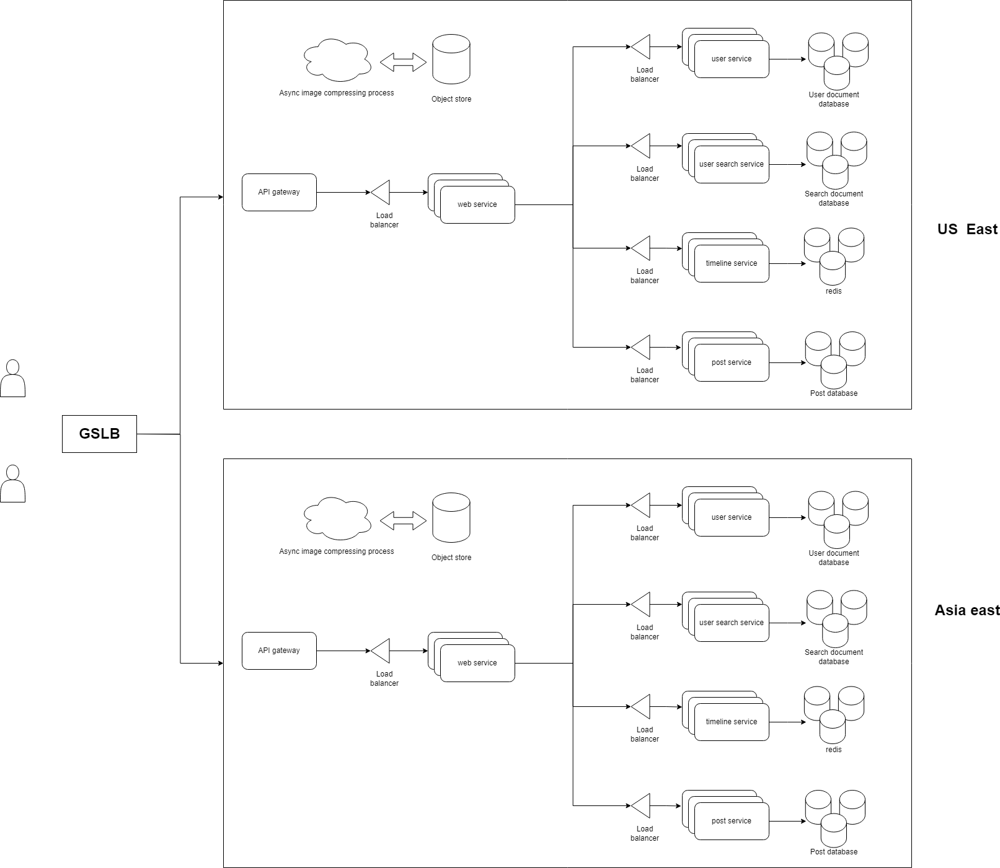

# System design

## Step-by-step process
- Gathering functional requirements
- Gathering non-function requirements
- Defining system's API and sequence of events
- Designing for functional requirements
- Addressing non-functional requirements

## Scalable image sharing social media platform
### Functional requirements:
- What info of users to store?
- What type of media can be shared? Text? Image? Video?
- What type of relationship between users?
- What operations can users perform on the platform?

`In scope`:
- When a user register, they provide:
  - Name, email, password, profile image
  - Optionally age, location
- Users can share only images
- Unidirectional relationship
- A user can:
  - Upload image
  - Search for other users
  - Follow or unfollow
  - View other users' profile, shared images
  - View newsfeed

`Out of scope`:
- Other formats like text, video
- Reaction, commenting ...

### Non-functinal requirements:
- Scalability:
  - Billion of users
  - Hundreds of millions visits/day
  - Each user uploads 1 image/day
  - Each image size ~2MB
  - Data processing volume ~1PD/day
- Availability:
  - 99.99% 
- Performance:
  - 500ms at 99 percentile
  - Timeline load time <1000ms at 99 percentile

### API design:
- Register, login and follow sequence:

  
- View newsfeed:

  
- System's APIs based on the sequence diagrams:
  - `get_homepage()`
  - `register()`
  - `login()`
  - `post_image()`
  - `search_user()`
  - `follow()`
  - `get_timeline()`

- `User service` is to save the user details to the database. 
- The user database should be documnet No SQL database due to the flexibility of adding new fields in the future.
- The user profile photos are stored in an `object store` and the users database only stores the URL.
- The `post service` and `post database` is to store the posts from users, the `post database` can simply be a SQL database with all the images stored in the `object store` and the `post database` only stores the URLs of a post.
- For searching, we should have a dedicated `search service` with text-based search engine like Elastic search and a document database
- To keep user `search service` and the `user service` in sync, we have a message broker in the middle so that every time an user is updated, `user service` sends an event to the broker and the `search service` can synchronize
- To store the relationship between 2 users, we can either use a `follow service` which is more complicated, or create a collection in the `user database` to store user IDs of the follower and the followee.
- When a user get home page, we can send a request to `user service` to get all users, then send another request to `post service` to get the latest posts from these users. This approach is not efficient.
- We can have a `timeline service` and a key/value database to cache the latest posts of a user. When post service inserts a new post, the `timeline service` updates asynchronously, pushes the new post in and the old post out. One of the issue is that the latest posts don't appear immediately on users' timelines and can only be eventually consistent but it's completely acceptable.
- We have implemented `CQRS pattern` when separate the read and write operations to user and `post database`.
- We also use `materialized view patterns` to optimize the post query time and avoid complex SQL query to the `post database`
  

## Non-functional requirements

### Scalability
- To increase the scalability of our services, we can have multiple instances of a service running with a load balancer/reverse proxy
- For the database, we need to shard the data the stored them on multiple databases. 
- We can use the `hash strategy` to equally distribute the data to multiple database instances. The hash key can be user ID which should be generated using a uniformed algo to make sure the data is equally distributed
- If we get more data, we can add more shards.
- We can do the same for the `document databases`
- To separate the frontend and backend code, we add an API gateway
  
### Availability
- We already have multiple instances of services but we need to add replicas to the databases
- We also need to host these servers in different locations to ensure the resilience/availability
  

### Performance
- For performance of the frontend, we can use a CDN to store HTML, JS, CSS files, and also images. The image compressing process can also be offloaded to the CDN
- For backend performance, the redis database should hold collections of each user's most recent posts and when a user queries for timeline, we query a list of followers from the user database then fetch the posts from redis
- The problem is some users have millions of followers so we need to categorize them as INFLUENCER.
- Every time an influencer makes a post, instead of updating millions of followers timelines, we just update the special influencer's post map in redis.
- The timeline service should fetch both regular and influencer users' posts based on a list of followees/influencers and merge them together.
- Each post should have a timestamp so that the timeline service can merge them chronologically