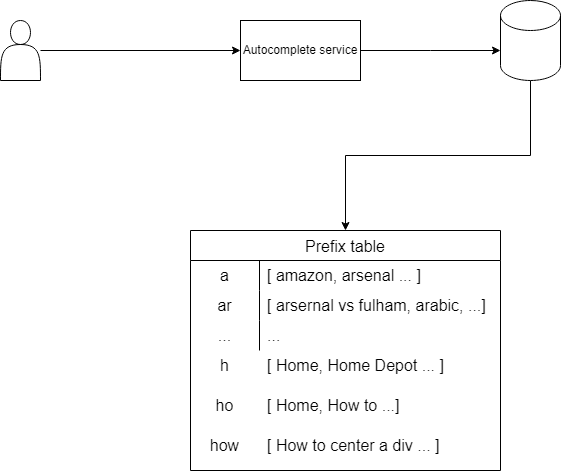
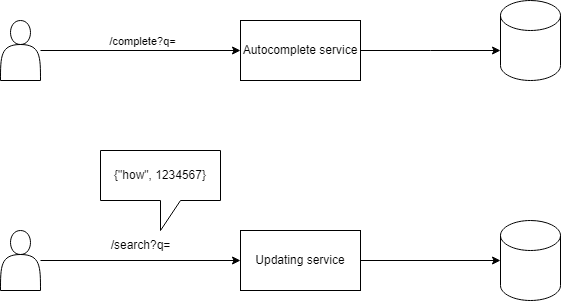
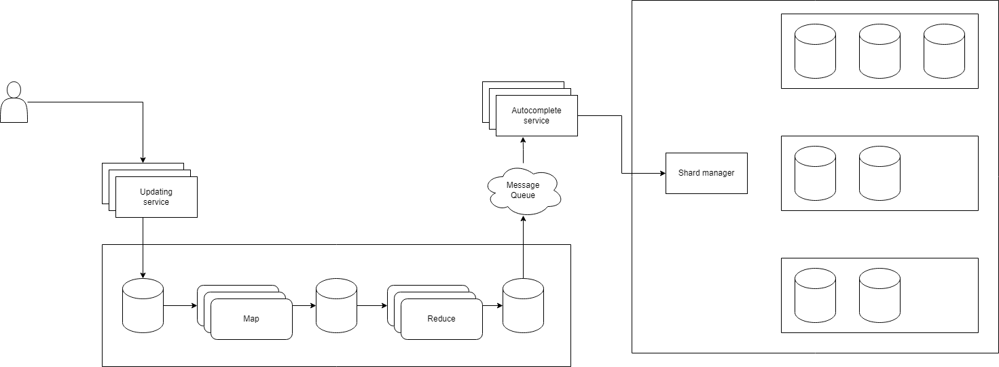

## Functional requirements
- Only English is supported
- Up to 10 autocomplete suggestions
- Maximum prefix is 60 characters
- Not support search engine or spell checking

## Non-functional requirements
- Billions queries per day
- Autocomplete response time < 240ms
- 1 hour lag between real time data for search query rankings
- Eventual consistency

## API design
- /complete?q=
- /search?q=
- `Lexical Prefix Tree` / `Trie`: is a tree that starts with a root of empty string, each node has a number of child nodes.
- Each node can store a character and has multi edges to other next characters
- However this approach is not possible due to the high traffic of queries, this tree will have to store all combinations possible. Considering each node has 26 child nodes, it's not possible to store in memory
- Thanks to the requirements that complete and search have different response time, we can have 2 different datasets instead of 1 and use `CQRS` - `Command and Query Responsibility Segregation` pattern
- Because the requirements allow a lag of 1 hour, we can use `Batch Processing Model` to update the datasets

## System design

- For /complete API, we have a `autocomplete service` that connects to a key/value database
- This database has a table mapping prefixes to the most popular searches

- When a user queries, the `updating service` will temporarily save the queries in a database for later processing

- From teh temporary database, first we check if these queries are from the last 24 hours
- Then we start to `map` all possible prefix along with their queries and number of times they're queried
- We don't necessarily have to store the prefix map on the same machine but can split them into multiple machines by hashing the prefixes
- Using reduce function, we can select the top 10 most queried phrases for each prefix and put the result into a table
- Update the `autocomplete database` with this table 
- This is a `map-function pattern`

### Scalability

- To improve the scalability of `autocomplete service` and `updating service`, we can have multi instances running
- For the autocomplete database, we can use sharding and partition to improve both high availability and performace
- However the traffic demands are not equal across the shards, some shards of hashed prefixes may have more traffic than the others.
- We can have a `shard management service` that can update the database with updated data and also scale up and down the number of partitions for each shard based on a threshold.
- This `shard management service` also need to maintain a minimum number of partitions to ensure availability
- The `updating pipeline` can be improved further by using sampling technique, we don't necessarily have to look at 100% data but only part of it
- We can also have multiple instances of `map` and `reduce` services, each processes part of the data based on the hashed prefixes